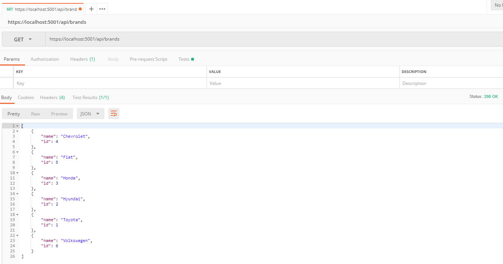
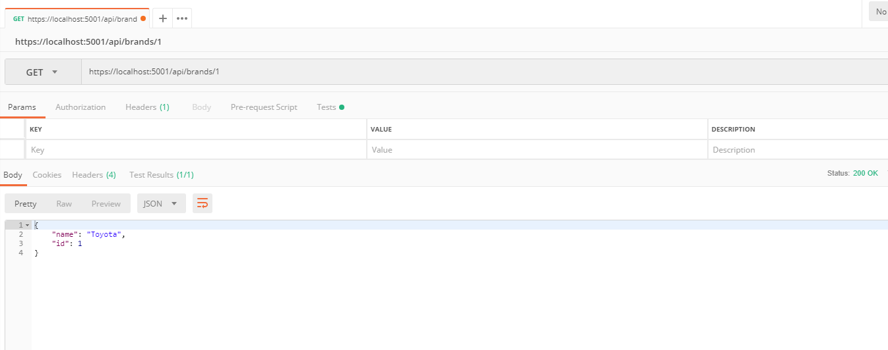
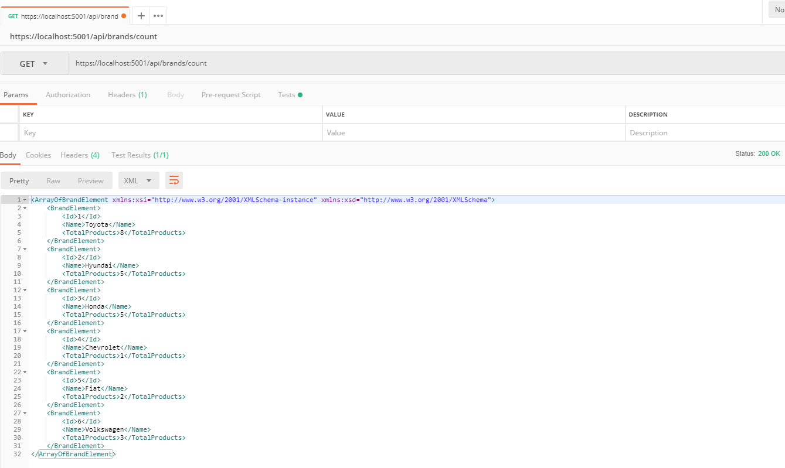
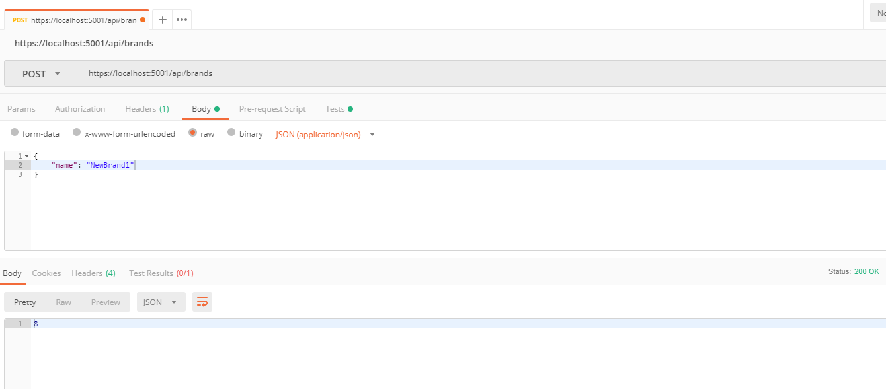
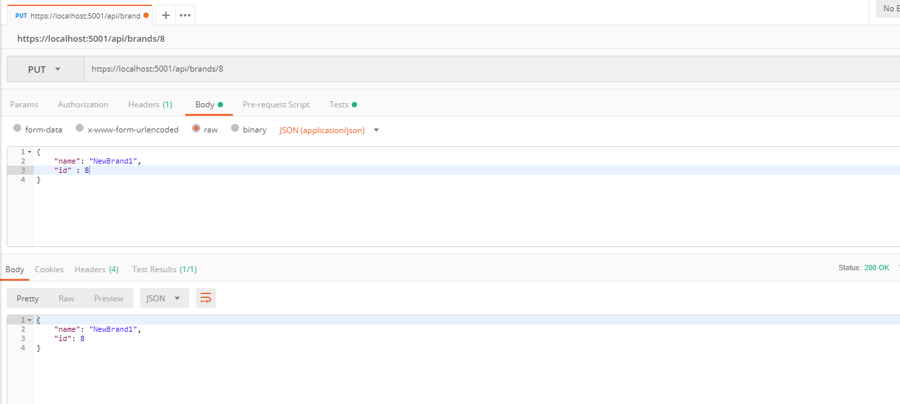
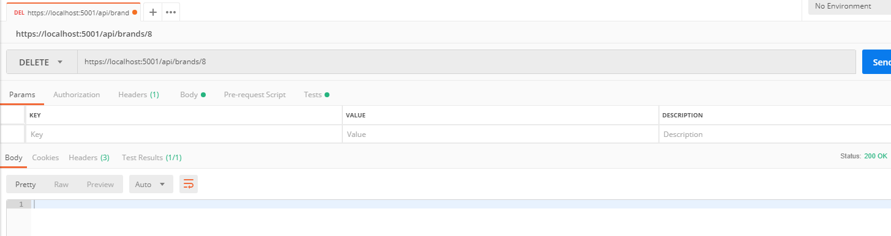

## Projects Name
Product API

## Description
A ASP.NET Core 2.1 Web Api project with DDD. The Product API supports the management of products and it`s brands


[](https://azuredeploy.net/)


See the Brands examples here: 

## URL

``` https://localhost:5001/index.html ```


## GET all Brands

``` https://localhost:5001/api/brands/ ```



## GET single Brands

``` https://localhost:5001/api/brands/1 ```



## GET Count Brands

``` https://localhost:5001/api/brands/count ```



## POST a Brands

``` http://localhost:5001/api/brands/ ```

```javascript
  {
      "name": "NewBrand",
  }
```



## PUT a Brand

``` http://localhost:5001/api/brands/1 ```

``` javascript
{
    "name": "NewBrand1",
    "id" : 7
}
```




## DELETE a Brand

``` http://localhost:5001/api/brands/7 ```


